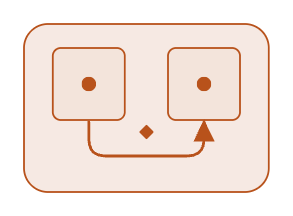
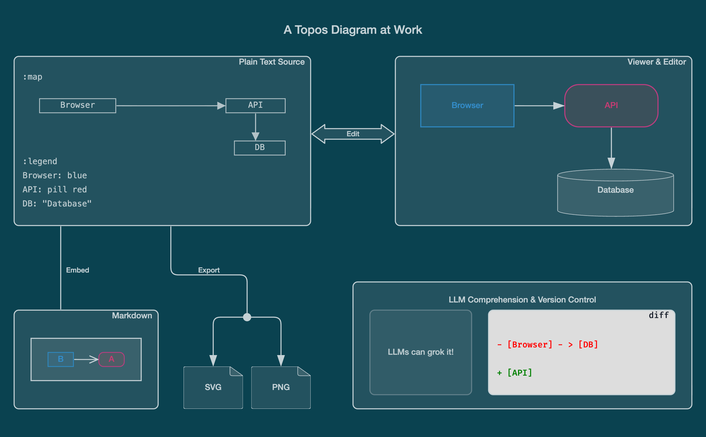
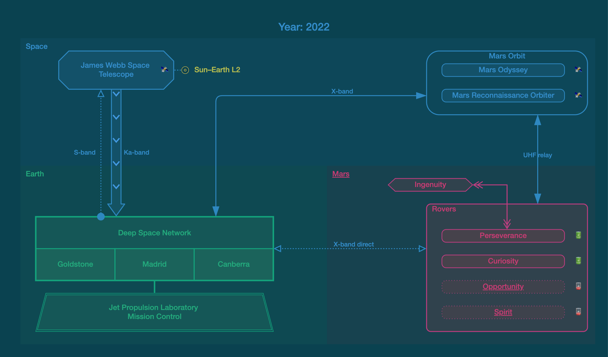

# Topos - AI-Era ASCII Diagrams



**Draw architecture visually. Keep the diagram itself readable and editable as plain text.**

Topos is a diagramming tool for software architecture and technical documentation. Its `.topos` source is itself a readable Unicode and ASCII diagram: characters form the boxes, connections, labels, and spatial arrangement. You can read it directly in a text editor, edit it there, or manipulate the same geometry visually in the Diagram Editor. Both ways edit the same artifact.

Rendering gives that artifact its presentation-grade graphical form. An optional Legend can add names, shapes, colors, and other presentation without taking the spatial structure out of the text.

Because the diagram remains ordinary text, it fits naturally into the workflows around code: version control, Markdown, clipboard, documentation, and coding agents.

When presentation matters, the same source renders as polished SVG or PNG.

Topos is currently best experienced through the VS Code extension. For syntax, examples, and a guided progression, read the [Guide to Topos Diagrams](<docs/Topos Guide.md>).

Here is Topos at work:



Here is the source behind it. The source is itself a readable diagram, with boxes, connections, and labels drawn directly in text:

```
                          # A Topos Diagram at Work

╭───────────── Plain Text Source ─╮          ╭─────────────── Viewer & Editor ─╮
│:map                             │          │                                 │
│                                 │          │  ┌─────────┐      ┌─────────┐   │
│  [Browser]────────────▸[ API ]  │          │  │ Browser ├─────▶│   API   │   │
│                           │     │          │  └─────────┘      └────┬────┘   │
│                           ▾     ◀───Edit───▶                        │        │
│                         [ DB ]  │          │                        ▼        │
│:legend                          │          │                  ┌────────────┐ │
│Browser: blue                    │          │                  │  Database  │ │
│API: pill red                    │          │                  └────────────┘ │
│DB: "Database"                   │          │                                 │
╰────┬────────────┬───────────────╯          ╰─────────────────────────────────╯
     │            │
     │            │
     │            │
     Embed        ╰─Export─╮
     │                     │            ╭──────────────────────────────────────╮
     │                     │            │  LLM Comprehension & Version Control │
╭────┴─Markdown─╮      ╭───●───╮        │ ╭──────────╮  ╭───────────── diff ─╮ │
│               │      │       │        │ │          │  │                    │ │
│ ┌───────────┐ │      │       │        │ │# LLMs can│  │- [Browser] - > [DB]│ │
│ │ [B]-->[A] │ │      │       │        │ │grok it!¶ │  │                    │ │
│ └───────────┘ │   ╭──▼──╮ ╭──▼──╮     │ │          │  │+ [API]             │ │
│               │   │ SVG │ │ PNG │     │ ╰──────────╯  ╰────────────────────╯ │
╰───────────────╯   ╰─────╯ ╰─────╯     ╰──────────────────────────────────────╯

:legend
Browser: blue
API: pill red
Database: @database
....
```

## One Diagram to Help Them All

### Draw and edit

- **One diagram.** The visual diagram and the text in source control are the same artifact. There is no second, hidden drawing file.
- **Two ways to edit.** Move boxes and connections visually, or edit the text directly. Both change the same readable `.topos` document.
- **Version-control friendly.** Save, search, review, and compare diagrams in meaningful diffs alongside the code they describe.

### Fits your workflow

- **Plain-text clipboard.** Copy a diagram or fragment into code, documentation, chat, or any other text destination, and paste text diagrams back in.
- **Markdown-native.** Put a fenced `topos` block beside your prose or link a local `.topos` file as an image and render it directly in VS Code's standard Markdown Preview.
- **Existing diagrams welcome.** Open, improve, preview, or export selected ASCII and Unicode diagrams without converting the surrounding document.

### View, publish, and automate

- **Live View** Keep a Preview beside the source, or switch the current editor to a fully rendered Viewer.
- **SVG and PNG export.** Preview the result, then copy SVG or save a polished image with optional control over theme, background, and size.
- **Command-line rendering.** Render `.topos` files from scripts and terminals with the CLI bundled into the extension.
- **Readable to coding agents.** Agents can understand and edit the diagram as text; one command copies the guidance and local tools they need.

## More than boxes and arrows

**Topos scales from quick sketches to detailed diagrams while remaining the same kind of readable text.** This Mars communications map combines regions, nested structure, different line styles, status glyphs, links, and a compact color palette:



The rendered image comes from this readable source:

```
:map

                              # Year: 2022
 ## Space
      ┌─────────────┐                                 ╭─────Mars Orbit────╮
      │  # JWST    S├┈◎ L2                            │ [    Odyssey   ] S│
      └────▵─┬──────┘                                 │                   │
           ┊ │            ╭─────────────X-band───────▶│ [      MRO     ] S│
           ┊ │            │                           ╰─────────────▲─────╯
           ┊ │            │                                         │
           ┊ │            │                                         │
           ┊ │            │                                         │
           ┊ │            │                                     UHF relay
 ## Earth  ┊ │            │                     ## Mars             │
           ┊ │            │                      <Ingenuity>«───┐   │
           ┊ │            │                                     │   ▼
           ┊ │            │                           ╭─Rovers──┼─────────╮
   ┏━━━━━━━┻━▼━━━━━━━━━━━━▼━━━━━━┓                    │         ⩔         │
   ┃     Deep Space Network      ┃                    │ [ Perseverance ] A│
   ┠─────────┬─────────┬─────────┨◃┈┈┈X-band direct┈┈▹│                   │
   ┃Goldstone│  Madrid │Canberra ┃                    │ [   Curiosity  ] A│
   ┗━━━━━━━━━┷━━━━┳━━━━┷━━━━━━━━━┛                    │                   │
                  ║                                   │ [  Opportunity ] X│
   ╔══════════════╩══════════════╗                    │                   │
   ║     JPL Mission Control     ║                    │ [    Spirit    ] X│
   ╚═════════════════════════════╝                    ╰───────────────────╯

:legend bg = #034
JPL%: "Jet Propulsion Laboratory ↵ Mission Control" trapez
Odyssey: "Mars Odyssey"
MRO: "Mars Reconnaissance Orbiter"
Spirit, Opportunity: dotted fill=soft
[Mars Orbit]: fill=none pill
Spirit: href="https://xkcd.com/695/"
Opportunity: href="https://xkcd.com/1504/"
A: "🔋"
X: "🪫"
S: "🛰️"
....
```

The map text arranges the content, while the Legend adds presentation without hiding that structure. The source and rendered result remain one diagram, ready for visual editing, review, and meaningful diffs.

## Why Topos

### I. The Three-Body Problem of Diagramming

When creating architectural diagrams, we are trapped in a trilemma:

1. **The Auto-Layout Trap:** Declarative text-to-diagram engines give us diffable source code, but surrender layout to automation. Position, proximity, grouping, and ordering are not presentation choices; they are architectural meaning expressed spatially. Those choices end up driven by heuristics optimizing edge length, crossings, and whitespace that have very little to do with preserving that meaning.

2. **The Graphical Trap:** Graphical drawing tools and infinite whiteboards preserve our spatial authorship, but they entomb that meaning. The "source" is usually an opaque binary blob—or, at best, proprietary and extremely verbose XML/JSON. It lives outside ordinary text workflows, is hostile to code review, and leaves coding agents dependent on vision-based interpretation or deciphering tool-specific serialization.

3. **The ASCII-Art Trap:** Traditional ASCII diagrams preserve readable spatial source directly in the text, but beyond simple sketches, authoring character-cell geometry becomes awkward—and the same artifact is the final presentation, locking the diagram into a charmingly nostalgic ASCII-art form. Some excellent tools make ASCII-art authoring far more comfortable through a separate graphical model. But once ASCII stops being the editable source and becomes the output format, the very property that made it valuable as a diagramming medium is lost.

### II. The Topos Bet

Topos makes a single core bet to break the trilemma:

**Position, grouping, routes, and containment are authored directly in the source. Their spatial arrangement is the meaning of the diagram. Topos gives that source comfortable geometry editing and presentation-grade vector graphic output.**

### III. Charting the Map

The Topos bet has an obvious price: if geometry lives in the source, geometry has to be authored there. Topos calls this spatial section the Map. Reading a map is easy; drawing and rearranging one in a text editor is not.

The original Topos design tried to solve this with the Napkin: a free-form description of intent from which an LLM would draw the Map. The division of labor seemed natural: the human supplied the meaning, the model handled the geometry.

In practice, current LLMs are simply not good enough at the second part. They can produce small diagrams, but reliability falls apart quickly as geometry becomes more demanding: alignment drifts, routes break, and changes that require several coordinated spatial edits become unpredictable. The Napkin depends on an ability the models do not have yet.

Curiously, the limitation is strongly asymmetric. LLMs can understand Topos diagrams considerably more complex than those they can reliably draw. They can follow connections and containment, reason about the architecture, review changes, and make local edits long after creating the same geometry from scratch has become unreliable. For silicon-based readers, spatial text remains a useful working representation even where reliable spatial authoring breaks down. That boundary may recede or disappear with future models, and Topos users will only benefit when it does.

For carbon-based authors, the practical answer became the Diagram Editor built into the Topos VS Code extension. It brings familiar direct-manipulation editing to shapes and connections, so spatial work feels like using a graphical tool: draw, move, resize, route, reshape. Yet every operation changes the Map text itself. The source remains the artifact.

### IV. Illuminating the Script

The Map has one job it cannot delegate: spatial structure. Shapes, connections, labels, containment, and layout belong there because their placement matters. Explanatory detail competes for the same space, and a diagram quickly becomes less useful when names, metadata, and decoration start pushing its structure apart.

The Legend takes that pressure off the Map. It can expand a terse label, attach semantics, choose a visual shape, or add presentation that plain text can only name rather than embody. Text can say blue; the rendered shape can simply be blue. Richer information remains attached to the diagram without demanding more room inside its geometry.

The idea comes from ordinary geographic maps. The map carries geography; the legend supplies presentational detail. Topos follows the same division: the Map carries the spatial statement, the Legend shapes its presentation.

The Legend itself is a compact, CSS-like rule language. Rules select things already present in the Map and enrich them with rendered labels, shapes, colors, fills, links, typography, and other properties. They can apply broadly or narrowly and compose; when rules conflict, the last one wins. Common choices can therefore be stated once and refined where needed.

Rendering brings the two together. The renderer preserves the authored layout — relative position, grouping, containment, and routing — without treating every character coordinate as sacred. It can center labels, refine shapes, adjust local spacing, and turn textual lines into SVG geometry, with the authored layout remaining the governing structure.

The payoff is a diagram meant to be presented to people, not merely tolerated as readable source. SVG gives Topos typography, color, shapes, effects, and resolution-independent output, while still allowing a diagram to remain visually neutral enough to belong in the document around it. A restrained palette can become light or dark, fills can remain subtle tints rather than fixed paint, and the diagram will look at home in documentation, a browser, or on a presentation slide.

### V. Living as Text

Once a diagram lives as ordinary text, it can move through the world disguised as code. Repositories, pull requests, tickets, and chats welcome it as one of their own. Through the harsh world of encodings, transport protocols, serializers, and indifferent software, it will survive and thrive.

The clipboard extends this portability to fragments. Select part of a diagram in the Diagram Editor and copy it; what lands on the clipboard is compact plain text, ready to drop into code, documentation, chat, or another diagram. The path works both ways: paste text diagrams back into the editor and they become editable geometry again.

Markdown is a natural habitat for Topos diagrams. With the extension installed, VS Code’s standard Markdown Preview renders fenced `topos` blocks in place beside the prose they explain. A standalone `.topos` file can also be linked as an ordinary Markdown image and rendered directly, so documentation can include the live diagram effortlessly.

From the command line, `.topos` files can be rendered directly to SVG for build pipelines and documentation tooling. The extension can export both SVG and PNG when a raster image is needed.

That is the Topos bet: readable source, authored layout, and presentable graphics can remain one artifact — when the spatial arrangement is worth authoring and preserving.

## Use Topos

The VS Code extension is currently the primary Topos experience. It includes:

- **Diagram Editor** for visual editing of the same `.topos` source.
- **Preview and Viewer** for working beside the source or viewing the finished diagram.
- **Markdown integration** for fenced diagrams and linked `.topos` images.
- **SVG and PNG export** for publishing and sharing.
- **Command-line rendering** to SVG for scripts and build pipelines.

Find Topos in the [VS Code Marketplace](https://marketplace.visualstudio.com/), then run **Topos: New Diagram** to start drawing.

Continue with the [Guide to Topos Diagrams](<docs/Topos Guide.md>). It develops one diagram from a small text sketch into a detailed rendered system and finishes with a compact reference. Extension-specific workflow details are in the [extension README](vscode-topos/README.md), and the command-line package has its own [README](package-topos/README.md).

## Development

The project describes itself in Topos. With the extension installed, both diagrams below render directly from their live `.topos` sources in VS Code’s Markdown Preview.

### Architecture

The architecture follows a Topos document through the core pipeline, rendered output, visual editor, and VS Code integration.


### Repository layout

The repository tree locates the core, visual editor, command-line package, extension, public documentation, and examples.

`src/enamel/compendium/` is the renderer's visual vocabulary. Its Topos source defines shapes, styles, markers, patterns, effects, and animations, then compiles into the assets used by Enamel.

`www/editor/` provides the standalone web editor and browser counterpart to the primary VS Code experience.


### Common development commands

Topos is developed in TypeScript with [Deno](https://deno.com/) as its primary runtime and toolchain. Deno manages dependencies and drives checking, testing, generation, and bundling. From the repository root:

```sh
deno task serve
deno task test
deno task ext:check
deno task ext:compile
```

`serve` runs the browser development surfaces, including the web editor. Run `deno task` to see the additional generation, packaging, watch, and coverage commands.

Pull requests are welcome on [GitHub](https://github.com/alexdrel/topos). See [CONTRIBUTING.md](CONTRIBUTING.md) for contribution terms, project boundaries, and generated-file guidance.

## Status

Topos is newly public and under active development. Expect its tools and capabilities to evolve as they meet the wider world.

## License

The diagram core, renderer, CLI, hosts, examples, and documentation are MIT-licensed. The visual editor in `src-editor/`, including bundled copies, is proprietary. See [LICENSE](LICENSE) for the complete terms.

## Acknowledgements

**[MonoSketch](https://monosketch.io/)** — an excellent graphical editor for ASCII diagrams and an influence on the thinking behind Topos.

**[JsonML](https://www.jsonml.org/)** — represents XML and HTML as JSON with striking simplicity, yet remains far less widely known than it should be. Topos uses it extensively throughout the implementation.
